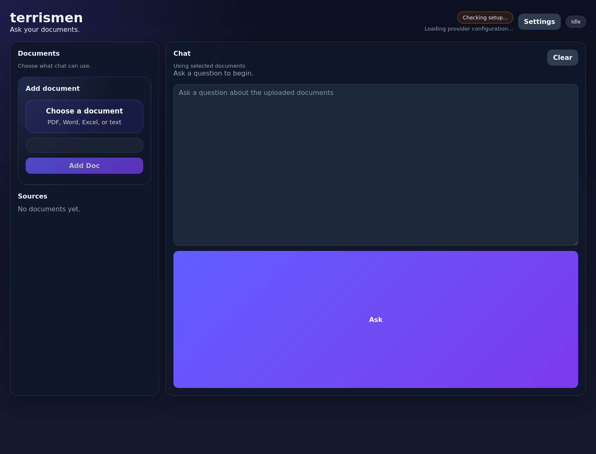

# terrismen

`terrismen` is a document-grounded note taking and chat application with a browser UI. It ingests uploaded files, reads them page-by-page or chunk-by-chunk, creates dense notes through an LLM, and answers follow-up questions using both the generated notes and the original source excerpts.

## App snapshot



## Features

- Web UI for provider settings, uploads, note browsing, and chat
- OpenAI-compatible provider support
- Native Ollama support
- PDF parsing with exact page references
- DOCX, DOC, XLSX, XLS, and plaintext parsing with stable locators
- Image forwarding to the configured model for multimodal note enrichment
- Page-level unresolved mystery capture for ambiguous or incomplete content
- End-of-document mystery review that links resolutions back to indexed notes and source references
- Grounded chat flow that cites the referenced source locations
- Local SQLite persistence for documents, sources, notes, and chat history

## How it works

1. Save provider settings in the UI.
2. Upload a document.
3. `terrismen` extracts source units:
   - PDFs become one source per page
   - DOCX, DOC, and plaintext become chunked source units
   - Excel files become sheet/row-range source units
4. If images are found in supported formats, they are sent to the configured model and described.
5. Each source unit plus any image descriptions is sent to the model to generate retrieval-friendly notes and unresolved mysteries when the page remains ambiguous.
6. After the full document is read, `terrismen` revisits every unresolved mystery, searches indexed notes and source excerpts, and stores any grounded resolutions with direct note/source references.
7. During chat, `terrismen` searches the stored notes and mystery resolutions, asks the model to pick the most relevant references, then answers from the original source excerpts and chat history.

See [`docs/llm-prompts.md`](docs/llm-prompts.md) for the current prompt inventory, when each prompt is sent, and the end-to-end LLM data flow.

## Requirements

- Python 3.11+
- A compatible model endpoint:
  - OpenAI-compatible: `POST /v1/chat/completions`
  - Ollama: `POST /api/chat`
- Optional: `antiword` for legacy `.doc` ingestion

## Run locally

```bash
python3 -m venv .venv
source .venv/bin/activate
pip install -e ".[dev]"
terrismen
```

By default the app listens on `http://127.0.0.1:8000`.

You can override the runtime path and bind address:

```bash
export TERRISMEN_DATA_ROOT=/tmp/terrismen-data
export TERRISMEN_HOST=0.0.0.0
export TERRISMEN_PORT=8000
terrismen
```

## Provider examples

### OpenAI-compatible

- Provider: `openai_compatible`
- Base URL: `https://your-provider.example.com`
- Model: provider-specific model name
- API key: provider-specific

### Ollama

- Provider: `ollama`
- Base URL: `http://localhost:11434`
- Model: `llama3.2-vision` or another installed model
- API key: leave blank

## Notes on source references

- PDFs use exact page numbers.
- DOCX, DOC, Excel, and plaintext use stable locators when real page numbers are not exposed by the format.
- Chat citations are rendered from the stored reference labels so answers can point back to the originating material.

## Development

Run the test suite:

```bash
pytest
```
