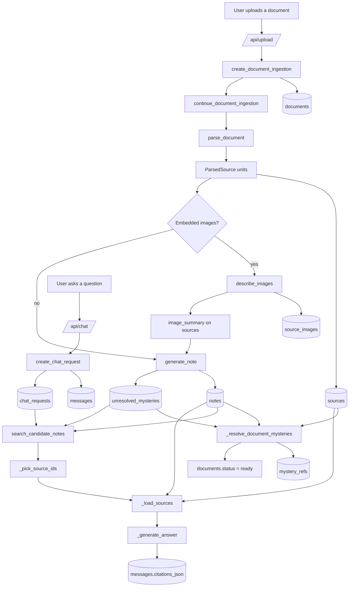
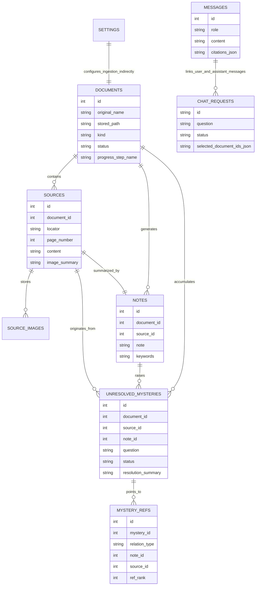

# Technical overview

This document explains the main technique `terrismen` uses to turn uploaded documents into grounded chat answers.

## End-to-end flow

## Document ingestion technique

### 1. Upload and document record

When a file is uploaded:

1. `create_document_ingestion(...)` validates provider settings and the file extension.
2. The raw upload is written to `data/uploads/`.
3. A row is inserted into `documents` with `status='processing'`.
4. The background ingestion worker continues from `continue_document_ingestion(...)`.

The `documents` table is the top-level job record. It tracks:

- original file name and stored path
- detected kind (`pdf`, `docx`, `xlsx`, `text`, and so on)
- status (`processing`, `ready`, `failed`)
- human-readable progress steps for the UI
- any ingestion error

### 2. Parsing into source units

The parser does not treat every format the same way. It converts each document into a list of `ParsedSource` units so retrieval and citation stay stable.

| Format | Parser behavior | Locator shape | Images |
| --- | --- | --- | --- |
| PDF | One source per readable page | `Page N` | Extracted per page |
| DOCX | Text is chunked by line count / size after paragraphs and tables are flattened | `Chunk N (lines X-Y)` | Extracted from document relationships and attached across chunks |
| DOC | Parsed through `antiword`, then chunked | `Chunk N (lines X-Y)` | No embedded image extraction |
| XLSX | Rows are grouped in batches of 40 per sheet | `Sheet <name> rows X-Y` | Extracted from sheet images and attached to the first chunk |
| XLS | Rows are grouped in batches of 40 per sheet | `Sheet <name> rows X-Y` | No embedded image extraction |
| TXT / MD / TEXT | Plaintext is chunked | `Chunk N (lines X-Y)` | None |

Each `ParsedSource` carries:

- `locator`: the stable reference shown later in the UI and citations
- `content`: extracted text for that source unit
- `page_number`: real page number for PDFs, otherwise a chunk/slice number
- `metadata`: parser-specific context such as kind or sheet name
- `images`: any extracted images associated with that source unit

Settings terminology note:

- `document_note_batch_size` refers to **source units** across all formats
- `mystery_resolution_batch_size` batches unresolved mysteries later in the pipeline
- the runtime now batches source units for normal-note generation before the later mystery-resolution pass

### 3. Source persistence

For each parsed source, `terrismen` inserts:

- one row into `sources`
- zero or more rows into `source_images`

`sources` holds the searchable source text plus:

- `locator`
- `page_number`
- `content`
- `image_summary`
- `metadata_json`

If a source has embedded images, they are written to disk under `data/images/`, described by the model, stored in `source_images`, and summarized back onto `sources.image_summary`.

## Note-generation technique

After parsing, `terrismen` groups source units into stable note-generation batches. Every source unit in a batch finishes image enrichment first, then the batch is sent to the model for one-or-more dense retrieval notes.

### Prompt inputs

`generate_batch_notes(...)` sends the model:

- one or more `source_id` values for the batch
- a reference label and locator for each source unit
- the source text for each source unit
- the image descriptions already persisted for each source unit in the batch

### Prompt outputs

The batch note-generation prompt asks for JSON with:

- `notes`: one or more retrieval-oriented note payloads
- each note payload includes ordered `source_ids`
- each note payload includes `note`, `keywords`, and optional `mysteries`
- each mystery names a single origin `source_id` inside that note payload

The result is stored as:

- one row in `notes`
- one-or-more rows in `note_sources` linking that note to its covered source units
- optional rows in `unresolved_mysteries`

The stored `notes.note` is intentionally denser than a casual summary. It is written for later retrieval, not only for display.

## What a “mystery” note is

A mystery is not a generic TODO. It is a structured record that says:

- this source raised a real ambiguity, unresolved reference, missing definition, contradiction, or unclear diagram detail
- the ambiguity was important enough to preserve for later resolution

Each mystery row stores:

- the owning `document_id`
- the originating `source_id`
- the `note_id` that discovered it
- the `question`
- the `reason` it is still unclear
- retrieval `keywords`
- current status (`open` or `resolved`)
- resolution summary and primary resolution references when available

## How mysteries are resolved

After all notes for a document exist, `terrismen` runs a second pass:

1. It loads unresolved mysteries in stable ID order.
2. For each mystery, it builds search text from the mystery question, reason, and keywords.
3. It searches the document's note corpus with FTS first, then a fallback `LIKE` query.
4. Mysteries with usable candidates are grouped into batches using `mystery_resolution_batch_size` (default `5`, valid range `1-20`).
5. Each batch is sent through the batch mystery-resolution prompt. By default the prompt includes notes only; raw source excerpts are added only when `mystery_resolution_reference_mode=notes_and_sources`.
6. The model returns per-mystery `resolved` / `open` decisions plus candidate `note_ids` and `source_ids`.
7. The app keeps only IDs that were actually present in the provided candidates, applies each mystery independently, and stores the primary resolution on `unresolved_mysteries` plus all ranked links in `mystery_refs`.

Important behavior:

- a final short batch is allowed when fewer than `N` mysteries remain
- one batch can mix `resolved`, still-`open`, and parser-fallback outcomes
- malformed results for one mystery do not block valid siblings in the same batch
- if the top-level batch response is unusable, the affected mysteries stay open with fallback summaries
- in `notes_only` mode, source refs are derived from selected note refs instead of pretending the model directly reviewed omitted source text

## How references work

References are built from `build_reference_label(document_name, locator, page_number)`.

- PDFs prefer `Document - Page N`
- all other formats use `Document - <locator>`

That same label is reused across:

- the notes page
- mystery review
- chat citations

This keeps the human-facing reference stable even though retrieval internally uses row IDs.

## Chat and grounded answering

When the user asks a question:

1. The question is saved in `messages`.
2. A `chat_requests` row tracks async progress and selected document scope.
3. `search_candidate_notes(...)` searches both:
   - `notes`
   - `unresolved_mysteries` (resolved and still-open mystery material)
4. `_pick_source_ids(...)` asks the LLM which candidate source IDs are relevant.
5. `_load_sources(...)` loads the chosen source blocks with note text and source excerpts.
6. `_generate_answer(...)` prompts the LLM to answer only from the supplied material.
7. The assistant response is stored in `messages`, along with structured citation metadata in `citations_json`.

The current answer prompt explicitly requires:

- no outside knowledge
- inline citations for factual claims
- no invented references
- a plain admission when the provided sources do not answer the question

## Search and retrieval strategy

The retrieval layer is intentionally simple and local:

- SQLite FTS5 indexes `notes`, `sources`, and `unresolved_mysteries`
- keyword queries are built from user text with basic stop-word removal
- the app prefers FTS results and falls back to `LIKE` matching when needed
- chat retrieval combines note hits and mystery-resolution hits, then deduplicates by source/note payload

This design keeps all search state local to the app database while still giving the model compact, grounded context.

## Stored data model

## Why this design exists

The core technique is to separate three different layers instead of collapsing everything into one embedding or one raw prompt:

1. **Source layer**: exact parsed excerpts and image summaries
2. **Note layer**: dense retrieval-friendly summaries and keywords
3. **Mystery layer**: unresolved or later-resolved ambiguities

That separation gives `terrismen` three useful properties:

- answers can still cite the original source locations
- retrieval can search compact notes instead of only long raw pages
- uncertainty is preserved explicitly instead of being silently hallucinated away

For the prompt inventory that powers these steps, see [`docs/llm-prompts.md`](llm-prompts.md).
